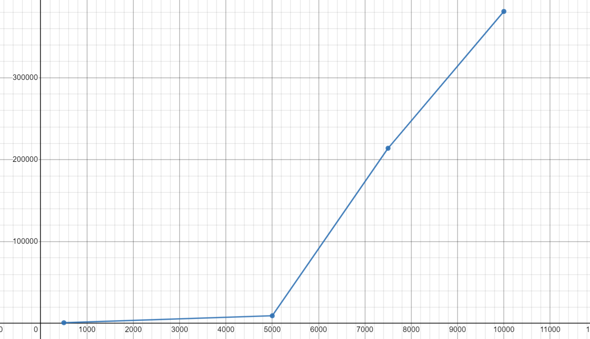

# How To Run

1st.
```
make
```
2nd.
```
./main.out
```
Outputs:
```
Matrix = [
6,      10,     6,
2,      1,      4,
0,      6,      3,      ]
Vector =[
1,
8,
7,      ]
Matrix Vector = [
128,
38,
69,     ]
```


# Space Complexity
1st.
``` 
make
```

2md.
``` 
./mainspace.out
```
my results:


Graph:



# Time Complexity
1st.
``` 
make
```


2nd.
``` 
./maintime.out
```

the data is stored in a time.dat file
```
(1000,0.009563),(1100,0.012612),(1200,0.013516),(1300,0.010682),(1400,0.014629),(1500,0.019703),(1600,0.019707),(1700,0.023037),(1800,0.033341),(1900,0.024731),(2000,0.025474),(2100,0.036250),(2200,0.038718),(2300,0.035737),(2400,0.043283),(2500,0.051016),(2600,0.050525),(2700,0.053480),(2800,0.056173),(2900,0.056045),(3000,0.069790),(3100,0.068107),(3200,0.086221),(3300,0.072118),(3400,0.088127),(3500,0.079392),(3600,0.087170),(3700,0.106146),(3800,0.110080),(3900,0.124514),(4000,0.110095),(4100,0.123140),(4200,0.218989),(4300,0.139630),(4400,0.135201),(4500,0.181698),(4600,0.195953),(4700,0.163360),(4800,0.170298),(4900,0.243620),(5000,0.281975)
```

Graph:

